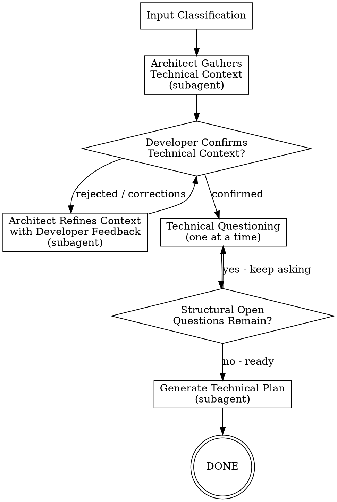
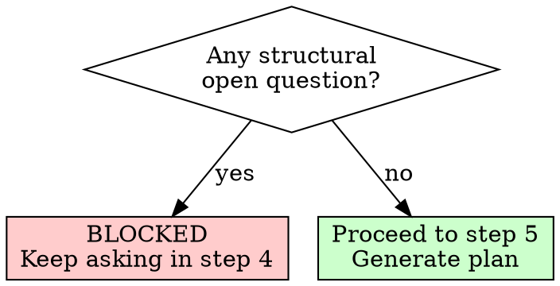

# /agentic:technical-planning - Spec to Technical Plan

**Usage:** `/agentic:technical-planning [<input>]`

Transform any product specification into a detailed technical plan by extracting every design/architecture decision from the developer before generating the plan.

## Arguments

- No args: prompt for spec/idea
- `path/to/spec.md`: use existing spec file
- `#123` or `https://github.com/.../issues/123`: fetch GitHub issue
- Inline text: direct description

## Workflow Overview

```
1. Input Classification -> 2. Architect Context Gathering (subagent) -> 3. Developer Confirms Context [loop if rejected] -> 4. Technical Questioning -> 5. Generate Technical Plan
```



---

## MANDATORY DELEGATION RULE

**You MUST delegate agent work using the `Task` tool. You MUST NOT perform agent work yourself.**

When a step says "delegate to Architect", you:
1. Use Task tool to spawn subagent
2. Pass prompt (which tells subagent to read its own instructions)
3. Wait for result
4. Validate output exists
5. Update workflow state

**You NEVER:**
- Explore codebase yourself (delegate to Architect)
- Write technical-context.md (delegate to Architect)
- Write technical-plan.md (delegate to Architect)

If you catch yourself doing agent work, STOP and use Task tool.

## Subagent Invocation Pattern

Always use `{subagentTypeGeneralPurpose}` subagent type:

```
Task(subagent_type="{subagentTypeGeneralPurpose}", prompt="You are the Architect agent. {ide-invoke-prefix}{ide-folder}/agents/architect.md for your full instructions. {task-specific context}")
```

Available agents: `architect`

---

## EXECUTION STEPS

Execute each step in order by reading the corresponding step file.

| Step | File | Description |
|------|------|-------------|
| 1 | `steps/step-01-input-classification.md` | Parse args, classify input, initialize state |
| 2 | `steps/step-02-architect-context.md` | Delegate context gathering to Architect subagent |
| 3 | `steps/step-03-confirm-context.md` | Developer confirms context; loop if rejected |
| 4 | `steps/step-04-technical-questioning.md` | Ask all technical questions one at a time |
| 5 | `steps/step-05-generate-plan.md` | Delegate plan generation to Architect subagent |

**Start by reading `steps/step-01-input-classification.md` and follow NEXT STEP at end of each file.**

---

## INTERACTIVE-ONLY WORKFLOW

This workflow is **always interactive**. The developer MUST answer every technical question. There is no auto mode - the entire point is to extract decisions from the developer.

---

## THE GATE RULE

**You MUST NOT proceed to step 5 (plan generation) if structural open questions remain.**

Structural open questions = questions about architecture, design patterns, data flow, component boundaries, libraries, APIs, or any decision that would change the shape of the implementation.

Minor open questions = cosmetic naming, log levels, comment wording. These can remain.



**If the developer says "just decide" or "I don't care":**
- Challenge once: "This decision affects [X]. Are you sure you want me to choose?"
- If they insist: log the decision as DEVELOPER_DEFERRED, make best-guess, proceed

---

## TEMPLATES

| Template | Purpose |
|----------|---------|
| `templates/workflow-state.yaml` | Workflow state tracking schema |

---

## ARTIFACTS

All outputs: `{ide-folder}/{outputFolder}/task/technical-planning/{topic}/{instance_id}/`

| Artifact | Description |
|----------|-------------|
| `workflow-state.yaml` | Workflow state tracking |
| `technical-context.md` | Codebase analysis from Architect |
| `technical-decisions.md` | All developer decisions from questioning |
| `technical-plan.md` | Final implementation plan |

---

## ERROR HANDLING

### Context Rejected Multiple Times
If developer rejects context 3+ times:
1. Log specific complaints
2. Ask developer to describe what's wrong in their own words
3. Feed verbatim description to Architect subagent

### Developer Refuses to Answer Questions
If developer says "skip" or "later" on a structural question:
1. Explain why this question is structural
2. If they insist: mark as UNRESOLVED_STRUCTURAL
3. **UNRESOLVED_STRUCTURAL questions block plan generation**

### Step Failure
If any step fails:
1. Log error in workflow-state.yaml
2. Set status: "failed"
3. Present error, ask how to proceed

---

## Execution

**Start workflow by reading step 1:**

```
Read steps/step-01-input-classification.md
```

Follow each step file's instructions sequentially. Each step ends with a reference to the next step.
