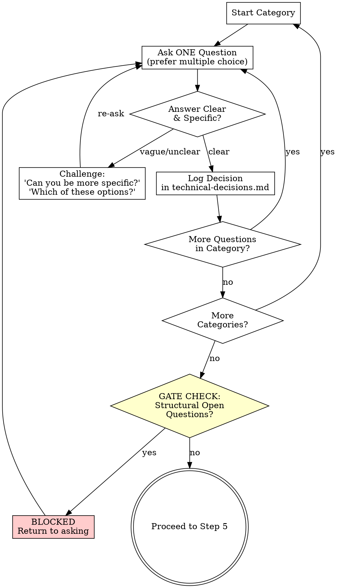

# Step 4: Technical Questioning

---

## ORCHESTRATOR ACTION

**You do this step yourself. This is the core of the workflow.**

Ask the developer every technical question needed to produce an unambiguous technical plan. One question at a time. Challenge vague answers. Do not stop until no structural open questions remain.

---

## PRINCIPLES

1. **One question at a time.** Never ask multiple questions in a single message.
2. **Prefer multiple choice** when options are enumerable (from codebase patterns or known approaches).
3. **Push hard.** Vague answers like "whatever works" or "you decide" get challenged.
4. **Use codebase context.** Reference specific patterns/files from `technical-context.md` in your questions.
5. **Track everything.** Every answer becomes a logged decision.

---

## QUESTION CATEGORIES

Work through these in order. Skip categories clearly irrelevant to the input spec. Adapt based on gaps.

### 1. Architecture & Design Patterns

- What architectural pattern? (e.g., layered, hexagonal, event-driven, CQRS)
- Where does this feature live in the existing architecture?
- New module/service or extend existing?
- Component boundaries and responsibilities?
- How does this integrate with existing modules?

### 2. Data Model & Storage

- New entities/tables? Schema shape?
- Relationships to existing data?
- Migration strategy? (if DB changes)
- Caching strategy?
- Data validation rules?

### 3. API & Contracts

- New endpoints/interfaces?
- Request/response shapes?
- Error semantics? (error codes, messages)
- Versioning approach?
- Breaking changes?

### 4. Dependencies & Libraries

- New libraries/packages needed? Which ones specifically?
- Version constraints?
- Why this library over alternatives?
- Internal dependencies between components?

### 5. State Management & Data Flow

- How does data flow through the system?
- State management approach? (if frontend)
- Event/message patterns? (if async)
- Side effects and where they happen?

### 6. Error Handling & Edge Cases

- Failure modes and recovery strategy?
- Retry logic?
- Graceful degradation?
- Known edge cases from the spec?

### 7. Security & Auth

- Authentication requirements?
- Authorization rules? (who can do what)
- Input validation?
- Sensitive data handling?

### 8. Testing Strategy

- What types of tests? (unit, integration, e2e)
- Mocking strategy? (what to mock, what to use real)
- Test data approach?
- Critical paths that need coverage?

### 9. Observability

- Logging requirements? (what to log, at what level)
- Metrics to track?
- Alerting needs?

### 10. Performance & Scalability

- Performance requirements/SLAs?
- Expected load?
- Optimization approach?
- Scaling strategy?

### 11. Deployment & Migration

- Feature flags needed?
- Rollback strategy?
- Migration steps? (if breaking changes)
- Configuration changes?

---

## QUESTIONING FLOW



### Challenging Weak Answers

When the developer gives a vague answer, use these patterns:

| Weak Answer | Challenge |
|-------------|-----------|
| "Whatever works" | "There are N options here: [list]. Each has trade-offs. Which fits best?" |
| "You decide" | "This affects [X]. I need your input. Here are the options: [A, B, C]" |
| "Standard approach" | "The codebase uses [pattern]. Should we follow that or is there a reason to diverge?" |
| "Doesn't matter" | "It matters for [reason]. Let me narrow it: [A] or [B]?" |
| "Later" / "Skip" | "This is a structural decision. Without it, the plan will have a gap. Can we decide now?" |
| "I don't know" | "Based on the codebase context, [option] seems most aligned. Does that work?" |

### Handling "Just Decide For Me"

If the developer insists you decide on a structural question:
1. Challenge once: "This decision affects [X]. Are you sure?"
2. If they insist: propose your recommendation with rationale
3. Ask: "Going with [recommendation]. Confirm?"
4. Log as `DEVELOPER_DEFERRED` decision

---

## DECISION LOGGING

Initialize `{output_path}/technical-decisions.md` at start of this step:

```markdown
# Technical Decisions - {topic}

> All architecture/design decisions made during technical questioning.

**Started:** {ISO_timestamp}

---

## Decisions

```

**For each answered question, append:**

```markdown
### TD-{number}: {Brief Title}

**Category**: {category name}
**Question**: {exact question asked}
**Answer**: {developer's answer}
**Decision**: {concrete decision derived from answer}
**Impact**: {what this decision affects in the plan}

---
```

**For DEVELOPER_DEFERRED decisions, append:**

```markdown
### TD-{number}: {Brief Title} [DEVELOPER_DEFERRED]

**Category**: {category name}
**Question**: {exact question asked}
**Developer said**: "just decide" / "you choose"
**Recommendation**: {your recommendation}
**Rationale**: {why}
**Developer confirmed**: yes/no

---
```

---

## GATE CHECK

After exhausting all relevant categories, perform the gate check.

### Classify Remaining Open Questions

For each unanswered question, classify as:

| Type | Definition | Blocks Plan? |
|------|-----------|-------------|
| **STRUCTURAL** | Changes shape of implementation (architecture, data model, APIs, component boundaries, library choices) | **YES** |
| **MINOR** | Cosmetic or easily changed later (naming, log levels, comment wording, exact error messages) | No |

### Gate Rules

**If STRUCTURAL open questions remain:**
```
We still have {N} structural open questions that would change the shape of the plan:

{numbered list of structural questions}

I need answers to these before generating the plan. Let's go through them.
```
Return to questioning.

**If only MINOR open questions remain:**
```
All structural decisions are made. There are {N} minor open questions remaining:

{numbered list of minor questions}

These won't affect the plan structure. I'll make reasonable defaults and note them.

Ready to generate the technical plan?
```

Wait for developer confirmation before proceeding.

---

## STEP COMPLETION

**Only when gate check passes (no structural open questions):**

Update `workflow-state.yaml`:

```yaml
artifacts:
  technical_decisions: "{output_path}/technical-decisions.md"

questions_asked: {total}
structural_open_questions: 0
decisions_logged: {total}

steps_completed:
  - step: 4
    name: "technical-questioning"
    completed_at: {ISO_timestamp}
    output: "{output_path}/technical-decisions.md"

current_step: 5
updated_at: {ISO_timestamp}
```

---

## NEXT STEP

Load `step-05-generate-plan.md`
