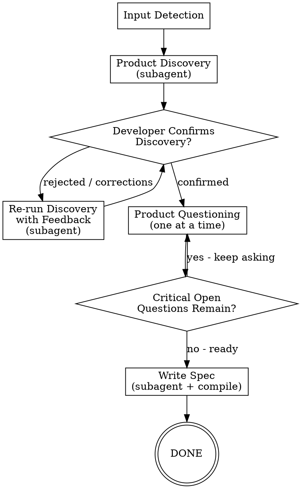
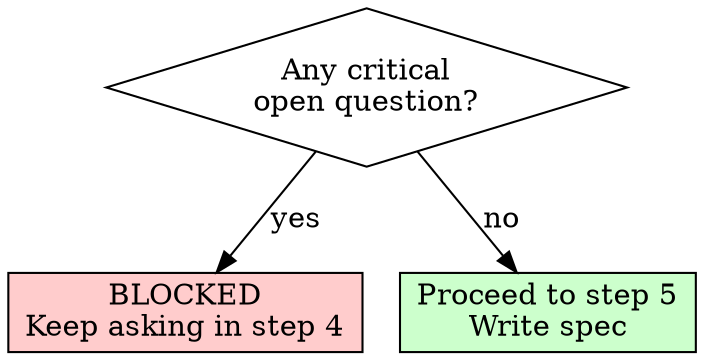

# /agentic:workflow:product-spec - Idea to Product Spec

**Usage:** `/agentic:workflow:product-spec [--auto] [<input>]`

Transform a rough idea into a precise product specification through rigorous questioning. No critical product question left unanswered.

## Arguments

- No args: Interactive mode, prompt for idea
- `--auto`: Autonomous mode with decision logging
- `path/to/notes.md`: Use existing notes/idea file
- `--auto path/to.md`: Auto mode with file input

## Workflow Overview

```text
1. Input Detection -> 2. Product Discovery (subagent) -> 3. Developer Confirms Discovery [loop if rejected] -> 4. Product Questioning -> 5. Write Spec
```



---

## Step Files

Execute steps in order. Each step file contains detailed instructions.

| Step | File | Description |
|------|------|-------------|
| 1 | `steps/step-01-input-detection.md` | Parse args, init state, generate topic slug |
| 2 | `steps/step-02-product-discovery.md` | Delegate discovery to subagent |
| 3 | `steps/step-03-confirm-discovery.md` | Developer confirms discovery; loop if rejected |
| 4 | `steps/step-04-product-questioning.md` | Ask remaining product questions one at a time |
| 5 | `steps/step-05-write-spec.md` | Delegate design, compile final spec |

**Start by reading `steps/step-01-input-detection.md` and follow NEXT STEP at end of each file.**

---

## Templates

| Template | Description |
|----------|-------------|
| `templates/workflow-state.yaml` | State tracking template |

## Subagent References

Each subagent reads its own instructions from `{ide-folder}/skills/agentic-skill-{skill}/SKILL.md`.

Invoke: `Task(subagent_type="{subagentTypeGeneralPurpose}", prompt="You are the {Agent} agent. {ide-invoke-prefix}{ide-folder}/skills/agentic-skill-{skill}/SKILL.md for your full instructions. ...")`

Available skills: `product-discovery`, `brainstorming`

---

## Mandatory Delegation

**You MUST delegate all discovery/design work using the Task tool. NEVER do it inline.**

You are the orchestrator. You:

- Parse input, detect mode
- Initialize state tracking
- Invoke subagents in sequence
- Handle handoffs between agents
- Validate outputs at each step
- Run the questioning loop yourself (step 4)
- Compile final spec

**You NEVER:**

- Ask discovery questions yourself in step 2 (delegate to Discovery subagent)
- Brainstorm design options yourself (delegate to Designer subagent)
- Write discovery documents yourself (delegate)

If you catch yourself doing agent work instead of delegating, STOP and use the Task tool.

---

## THE GATE RULE

**You MUST NOT proceed to step 5 (spec writing) if critical open questions remain.**

Critical open questions = questions about problem definition, target users, success metrics, scope boundaries, acceptance criteria, or any decision that would change the shape of the spec.

Minor open questions = visual preferences, nice-to-have details, future iteration ideas. These can remain.



**If the developer says "just decide" or "I don't care" (interactive mode):**

- Challenge once: "This shapes the spec. Are you sure you want me to choose?"
- If they insist: log as DEVELOPER_DEFERRED, make best-guess, proceed

---

## Mode Behaviors

**Interactive Mode (default):**

- Discovery subagent asks user questions one at a time
- Challenges vague answers, pushes for specifics
- Present discoveries for review before proceeding
- Orchestrator runs questioning loop in step 4
- Gate blocks spec if critical questions remain

**Auto Mode (--auto):**

- Subagents make autonomous decisions with confidence logging
- Log ALL decisions and assumptions in `decision-log.md`
- Flag low confidence (<90%) decisions for review
- Skip step 3 (confirmation) and step 4 (questioning)
- Continue without human input unless blocked

---

## Execution

**Start workflow by reading step 1:**

```text
Read steps/step-01-input-detection.md
```

Follow each step file's instructions sequentially. Each step ends with a reference to the next step.

---

## Decision Logging Protocol (Auto Mode)

When making autonomous decisions, append to `decision-log.md`:

```markdown
### DEC-{number}: {Brief Title}

**Step**: {current_step_name}
**Agent**: {deciding_agent}
**Timestamp**: {ISO timestamp}

**Context**:
{What question or ambiguity arose}

**Options Considered**:
1. {Option A} - {pros/cons}
2. {Option B} - {pros/cons}

**Decision**: {Chosen option}

**Confidence**: {percentage}%

**Rationale**:
{Why this choice was made}

---
```

---

## Error Handling

### Discovery Incomplete

If discovery output missing required sections:

1. Log which sections are missing
2. Interactive: Ask user to provide missing info
3. Auto: Make reasonable assumptions, log them, proceed

### Discovery Rejected Multiple Times

If developer rejects discovery 3+ times:

1. Log specific complaints
2. Ask developer to describe what's wrong in their own words
3. Feed verbatim description to Discovery subagent

### Developer Refuses to Answer Questions

If developer says "skip" or "later" on a critical question:

1. Explain why this question is critical for the spec
2. If they insist: mark as UNRESOLVED_CRITICAL
3. **UNRESOLVED_CRITICAL questions block spec generation**

### Step Failure

If any step fails:

1. Log error in workflow-state.yaml
2. Set status: "failed"
3. Interactive: Present error, ask how to proceed
4. Auto: Attempt recovery once, then halt with detailed error log

---

## Artifacts

All outputs: `{ide-folder}/{outputFolder}/product/specs/{topic}/{instance_id}/`

- `workflow-state.yaml`
- `decision-log.md` (auto mode)
- `discovery-{topic}.md`
- `product-decisions.md`
- `spec-{topic}.md`
