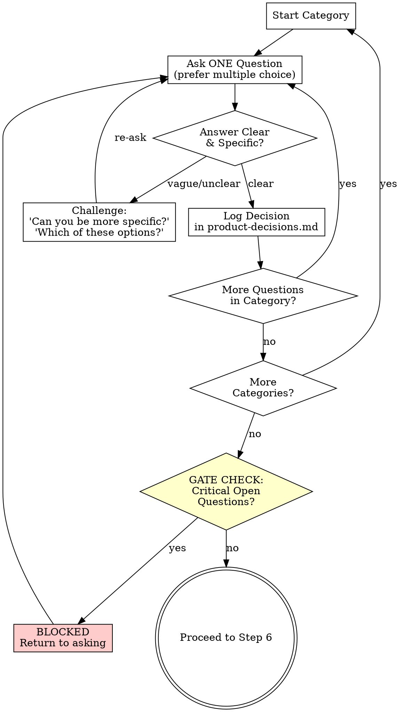

# Step 5: Product Questioning

---

## ORCHESTRATOR ACTION

**You do this step yourself. This is the core of the workflow.**

**Auto mode:** Skip this step entirely. Go to step 6.

Ask the developer every product question needed to produce an unambiguous spec. One question at a time. Challenge vague answers. Do not stop until no critical open questions remain.

---

## PRINCIPLES

1. **One question at a time.** Never ask multiple questions in a single message.
2. **Prefer multiple choice** when options are enumerable.
3. **Push hard.** Vague answers like "whatever works" or "you decide" get challenged.
4. **Use discovery context.** Reference specific findings from `discovery-{topic}.md` in your questions.
5. **Use codebase context.** Reference integration points and constraints from `context-{topic}.md` to ask informed questions about how the feature fits the existing system.
6. **Track everything.** Every answer becomes a logged decision.

---

## QUESTION CATEGORIES

Work through these in order. Skip categories already fully covered by discovery. Focus on gaps.

### 1. Problem Clarity

- Is the problem statement precise enough to build from?
- Are there sub-problems not yet articulated?
- Is the "why now" clear?
- What happens if we don't solve this?

### 2. User Precision

- Are all user types identified? (not just "users")
- What's each user type's frequency of interaction?
- What's the user journey for each type?
- Are there admin/ops users we're missing?

### 3. Success Metrics Specificity

- Are metrics measurable with existing infrastructure?
- What are the target numbers? (not just "improve X")
- What's the measurement timeframe?
- What's the baseline today?

### 4. Scope Boundaries

- Is every item in "In Scope" necessary for v1?
- Is anything in "Out of Scope" actually needed?
- Are deferred items truly deferrable?
- Is the scope achievable in the timeline?

### 5. Acceptance Criteria Completeness

- Does each AC describe observable behavior?
- Are ACs testable and unambiguous?
- Are there missing happy paths?
- Are there missing error/edge case paths?
- Do ACs cover all user types?

### 6. Edge Cases & Error States

- What happens on invalid input?
- What happens on timeout/network failure?
- What happens with concurrent users?
- What are the boundary conditions?
- What data edge cases exist? (empty, huge, malformed)

### 7. Integration & Existing System

- How does this feature interact with existing modules identified in `context-{topic}.md`?
- Are there existing patterns that constrain the solution?
- What existing behavior might break or need adaptation?
- Are there data model implications for existing entities?

### 8. Business Rules & Constraints

- Are there compliance/regulatory requirements?
- Are there business rules not yet captured?
- Are there SLAs or performance expectations?
- Are there integration constraints with other teams/systems?

### 9. User Experience Expectations

- What's the expected interaction model? (wizard, single page, progressive)
- What feedback does the user need at each step?
- What are the loading/waiting expectations?
- What's the error recovery UX?

---

## QUESTIONING FLOW



### Challenging Weak Answers

When the developer gives a vague answer, use these patterns:

| Weak Answer | Challenge |
|-------------|-----------|
| "All users" | "Which specific user types? Role, context, frequency?" |
| "It should be fast" | "What's the target? Under 200ms? Under 1s? What's acceptable?" |
| "Whatever makes sense" | "There are N options: [list]. Each has trade-offs. Which fits?" |
| "You decide" | "This shapes the spec. I need your input: [A, B, or C]?" |
| "Standard behavior" | "Standard for whom? Can you describe the exact expected behavior?" |
| "Doesn't matter" | "It matters for [reason]. Let me narrow it: [A] or [B]?" |
| "Later" / "Skip" | "This is a critical product question. Without it, the spec will have a gap. Can we decide now?" |
| "I don't know" | "Based on the discovery, [option] seems most likely. Does that work?" |
| "Just make it work" | "What does 'working' look like? Describe the happy path outcome." |

### Handling "Just Decide For Me"

If the developer insists you decide on a critical question:

1. Challenge once: "This shapes the spec. Are you sure?"
2. If they insist: propose your recommendation with rationale
3. Ask: "Going with [recommendation]. Confirm?"
4. Log as `DEVELOPER_DEFERRED` decision

---

## DECISION LOGGING

Initialize `{output_path}/product-decisions.md` at start of this step:

```markdown
# Product Decisions - {topic}

> All product decisions made during questioning.

**Started:** {ISO_timestamp}

---

## Decisions
```

**For each answered question, append:**

```markdown
### PD-{number}: {Brief Title}

**Category**: {category name}
**Question**: {exact question asked}
**Answer**: {developer's answer}
**Decision**: {concrete decision derived from answer}
**Impact**: {what this decision affects in the spec}

---
```

**For DEVELOPER_DEFERRED decisions, append:**

```markdown
### PD-{number}: {Brief Title} [DEVELOPER_DEFERRED]

**Category**: {category name}
**Question**: {exact question asked}
**Developer said**: "just decide" / "you choose"
**Recommendation**: {your recommendation}
**Rationale**: {why}
**Developer confirmed**: yes/no

---
```

---

## GATE CHECK

After exhausting all relevant categories, perform the gate check.

### Classify Remaining Open Questions

For each unanswered question, classify as:

| Type | Definition | Blocks Spec? |
|------|-----------|-------------|
| **CRITICAL** | Changes shape of spec (problem definition, users, metrics, scope, ACs, business rules) | **YES** |
| **MINOR** | Nice-to-have details, visual preferences, future iteration ideas | No |

### Gate Rules

**If CRITICAL open questions remain:**

```text
We still have {N} critical open questions that would change the shape of the spec:

{numbered list of critical questions}

I need answers to these before writing the spec. Let's go through them.
```

Return to questioning.

**If only MINOR open questions remain:**

```text
All critical product decisions are made. There are {N} minor open questions remaining:

{numbered list of minor questions}

These won't affect the spec structure. I'll make reasonable defaults and note them.

Ready to write the spec?
```

Wait for developer confirmation before proceeding.

---

## STEP COMPLETION

**Only when gate check passes (no critical open questions):**

Update `workflow-state.yaml`:

```yaml
artifacts:
  product_decisions: "{output_path}/product-decisions.md"

questions_asked: {total}
critical_open_questions: 0
decisions_logged: {total}

validation:
  gate_passed: true

steps_completed:
  - step: 5
    name: "product-questioning"
    completed_at: {ISO_timestamp}
    output: "{output_path}/product-decisions.md"

current_step: 6
updated_at: {ISO_timestamp}
```

---

## NEXT STEP

Load `step-06-write-spec.md`
