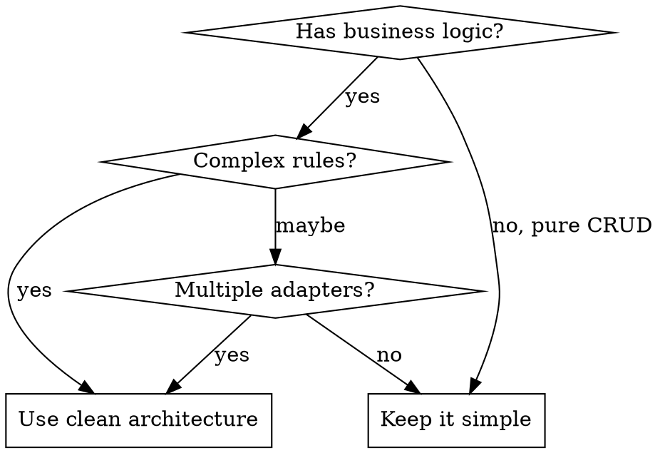

# Clean Architecture

## Overview

**Business logic stays pure, infrastructure stays outside.**

All three patterns (Clean, Hexagonal, Onion) share one rule: **dependencies point inward**. Domain knows nothing about HTTP, databases, or frameworks.

## When to Use



**Use when:**
- Business rules exist (validation, calculations, state transitions)
- Rules need testing without infrastructure
- Multiple entry points (API, CLI, queue, events)
- External systems may change (payment providers, DBs)

**Skip when:**
- Pure CRUD with no business logic
- Simple scripts or utilities
- Prototypes / throwaway code
- Single adapter, simple rules

## Layers

| Layer | Contains | Depends On | Never Contains |
|-------|----------|------------|----------------|
| **Domain** | Entities, Value Objects, Domain Services | Nothing | Framework code, annotations, I/O |
| **Application** | Use Cases, DTOs, Port interfaces | Domain | Direct infrastructure calls |
| **Infrastructure** | Adapters, ORM, HTTP clients | Application, Domain | Business rules |
| **Presentation** | Controllers, CLI handlers | Application | Business logic |

## The Dependency Rule

```
Presentation → Application → Domain
     ↓              ↓
Infrastructure ────┘
```

**Outer layers know inner. Inner layers know nothing about outer.**

When execution flows outward (domain needs DB), use **Dependency Inversion**: domain defines interface (Port), infrastructure implements it (Adapter).

## Ports and Adapters

**Port** = interface defined by domain/application for what it needs
**Adapter** = infrastructure implementation of that interface

```typescript
// Port (in application layer) - defines WHAT we need
interface PaymentGateway {
  charge(amount: Money, customerId: string): Promise<Result<PaymentResult, PaymentError>>;
}

// Adapter (in infrastructure) - implements HOW, wraps external errors
class StripeAdapter implements PaymentGateway {
  constructor(private readonly stripe: Stripe) {}

  async charge(amount: Money, customerId: string): Promise<Result<PaymentResult, PaymentError>> {
    try {
      const charge = await this.stripe.charges.create({ ... });
      return Ok({ id: charge.id, status: 'completed' });
    } catch (error) {
      return Err({ code: 'PAYMENT_FAILED', message: error.message });
    }
  }
}
```

**Primary adapters** (drive the app): Controllers, CLI, Message handlers
**Secondary adapters** (driven by app): Repositories, External APIs, Email services

## Domain Model Patterns

### Entities (Identity + Behavior)
```typescript
interface OrderError {
  readonly code: 'ORDER_NOT_DRAFT' | 'INVALID_ITEM';
  readonly message: string;
}

class Order {
  private constructor(
    readonly id: OrderId,
    private items: readonly OrderItem[],
    private status: OrderStatus
  ) {}

  // Business logic returns Result, no throwing
  addItem(item: OrderItem): Result<Order, OrderError> {
    if (this.status !== 'draft') {
      return Err({ code: 'ORDER_NOT_DRAFT', message: 'Cannot modify non-draft order' });
    }
    return Ok(new Order(this.id, [...this.items, item], this.status));
  }

  calculateTotal(): Money {
    return this.items.reduce((sum, i) => sum.add(i.total()), Money.zero());
  }
}
```

### Value Objects (Immutable, no identity)
```typescript
interface MoneyError {
  readonly code: 'NEGATIVE_AMOUNT' | 'CURRENCY_MISMATCH';
  readonly message: string;
}

class Money {
  private constructor(readonly amount: number, readonly currency: string) {}

  static create(amount: number, currency: string): Result<Money, MoneyError> {
    if (amount < 0) {
      return Err({ code: 'NEGATIVE_AMOUNT', message: 'Money cannot be negative' });
    }
    return Ok(new Money(amount, currency));
  }

  add(other: Money): Result<Money, MoneyError> {
    if (this.currency !== other.currency) {
      return Err({ code: 'CURRENCY_MISMATCH', message: `Cannot add ${this.currency} to ${other.currency}` });
    }
    return Ok(new Money(this.amount + other.amount, this.currency));
  }
}
```

### Domain Services (Cross-entity logic)
```typescript
class PricingService {
  calculateDiscount(customer: Customer, order: Order): Result<Money, PricingError> {
    // Logic spanning multiple entities
  }
}
```

## Use Cases (Application Layer)

Thin orchestration - no business logic here:

```typescript
interface PlaceOrderError {
  readonly code: 'CUSTOMER_NOT_FOUND' | 'ORDER_CREATION_FAILED';
  readonly message: string;
}

class PlaceOrderUseCase {
  constructor(
    private readonly customerRepo: CustomerRepository,
    private readonly orderRepo: OrderRepository,
    private readonly notifications: NotificationPort
  ) {}

  async execute(cmd: PlaceOrderCommand): Promise<Result<Order, PlaceOrderError>> {
    const customer = await this.customerRepo.findById(cmd.customerId);
    if (!customer) {
      return Err({ code: 'CUSTOMER_NOT_FOUND', message: `Customer ${cmd.customerId} not found` });
    }

    const orderResult = Order.create(customer, cmd.items);
    if (!orderResult.ok) {
      return Err({ code: 'ORDER_CREATION_FAILED', message: orderResult.error.message });
    }

    await this.orderRepo.save(orderResult.value);
    await this.notifications.orderPlaced(orderResult.value);

    return Ok(orderResult.value);
  }
}
```

## Red Flags

| Smell | Problem | Fix |
|-------|---------|-----|
| `import { Repository } from 'typeorm'` in domain | ORM in domain | Define own interface |
| Business rule in controller | Logic in wrong layer | Move to domain entity/service |
| `if (dto.type === 'X')` in use case | Business logic leaked | Move to domain |
| Entity is just data + getters | Anemic domain model | Add behavior methods |
| 10 interfaces for CRUD endpoint | Over-engineering | Simplify, add abstraction when needed |
| Can't test rule without DB | Coupled domain | Extract pure function/method |

## Testing Strategy

| Layer | Test Type | Speed | What to Mock |
|-------|-----------|-------|--------------|
| Domain | Unit | <1ms | Nothing (pure) |
| Application | Unit | <10ms | Ports (repos, external) |
| Adapters | Integration | 100ms+ | External services (WireMock) |
| E2E | Full stack | 1s+ | Nothing |

**Domain tests are the most valuable** - fast, stable, test actual business rules.

## Dependency Injection

```typescript
// Composition root (main.ts or DI container)
const stripe = new Stripe(config.stripeKey);
const pool = new Pool(config.dbUrl);

const paymentGateway = new StripeAdapter(stripe);
const orderRepo = new PostgresOrderRepository(pool);
const notifications = new EmailNotificationAdapter(sendgrid);

const placeOrder = new PlaceOrderUseCase(orderRepo, paymentGateway, notifications);
```

**Rules:**
- Inject dependencies, never instantiate in business code
- Constructor injection preferred
- Interfaces over concrete types
- Compose at application startup

## Common Mistakes

**Premature abstraction**
Don't create `IUserMapper`, `ICacheService` for simple CRUD. Add abstractions when real requirements demand them.

**Interface per class**
Not every class needs an interface. Only create interfaces at architectural boundaries (ports).

**Anemic domain**
Entities with only getters + services with all logic = procedural code in OO clothing. Put behavior in entities.

**Framework annotations in domain**
`@Entity`, `@Column`, `@JsonProperty` in domain class = infrastructure leak. Map at adapter boundary.

## Quick Checklist

Before committing code with business logic:

- [ ] Domain entities have behavior, not just data
- [ ] Business rules testable without DB/HTTP
- [ ] No framework imports in domain layer
- [ ] Use case orchestrates, doesn't contain business logic
- [ ] Ports defined by what domain needs, not what infrastructure provides
- [ ] Value objects for domain concepts (Money, Email, OrderId)
