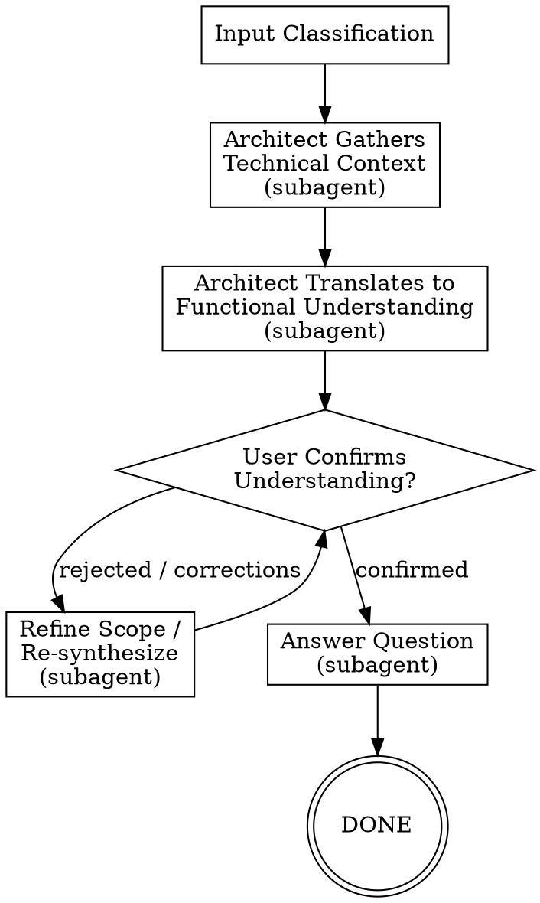
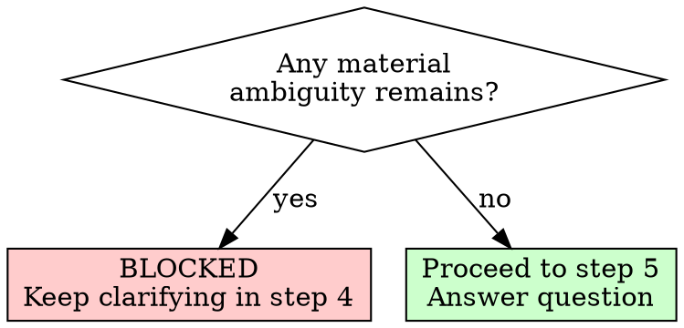

# /agentic:workflow:ask-codebase - Codebase to Functional Understanding

**Usage:** `/agentic:workflow:ask-codebase [<input>]`

Answer questions about existing behavior by first gathering technical context from the codebase, then translating that into functional understanding for non-technical audiences.

## Arguments

- No args: prompt for the question
- `path/to/question.md`: use an existing question or notes file
- `#123` or `https://github.com/.../issues/123`: use a GitHub issue as the question source
- Inline text: direct question

## Workflow Overview

```
1. Input Classification -> 2. Architect Context Gathering (subagent) -> 3. Functional Understanding Synthesis (subagent) -> 4. User Confirms Understanding [loop if rejected] -> 5. Answer the Question (subagent)
```



---

## MANDATORY DELEGATION RULE

**You MUST delegate agent work using the `Task` tool. You MUST NOT perform codebase analysis or answer synthesis yourself.**

When a step says "delegate to Architect", you:
1. Use the `Task` tool to spawn the subagent
2. Pass the subagent prompt that tells it to read its own instructions
3. Wait for the result
4. Validate the output exists
5. Update workflow state

**You NEVER:**
- Explore the codebase yourself
- Write `technical-context.md` yourself
- Write `functional-understanding.md` yourself
- Write `answer.md` yourself

If you catch yourself doing agent work instead of delegating, STOP and use the `Task` tool.

## Subagent Invocation Pattern

Always use `{subagentTypeGeneralPurpose}` subagent type:

```
Task(subagent_type="{subagentTypeGeneralPurpose}", prompt="You are the Architect agent. {ide-invoke-prefix}{ide-folder}/agents/agentic-agent-architect.md for your full instructions. {task-specific context}")
```

Available agents: `agentic:agent:architect`

---

## EXECUTION STEPS

Execute each step in order by reading the corresponding step file.

| Step | File | Description |
|------|------|-------------|
| 1 | `steps/step-01-input-classification.md` | Parse args, classify the question, initialize state |
| 2 | `steps/step-02-architect-context.md` | Delegate codebase context gathering to Architect |
| 3 | `steps/step-03-functional-understanding.md` | Delegate plain-language functional synthesis to Architect |
| 4 | `steps/step-04-confirm-understanding.md` | User confirms the interpreted scope; loop if needed |
| 5 | `steps/step-05-answer-question.md` | Delegate final answer writing to Architect |

**Start by reading `steps/step-01-input-classification.md` and follow NEXT STEP at end of each file.**

---

## INTERACTIVE-ONLY WORKFLOW

This workflow is **always interactive**. The whole point is to let a person ask a question in plain language, confirm the interpreted scope, and receive a code-informed answer they can understand.

---

## THE GATE RULE

**You MUST NOT proceed to step 5 (final answer) if material ambiguity remains about what behavior the user wants explained.**

Material ambiguity = uncertainty about the user journey, actor, entry point, lifecycle stage, or edge condition being asked about. If that ambiguity would change the answer, it is blocking.

Minor ambiguity = wording preference, level of detail, or whether to include extra examples. These do not block.



---

## TEMPLATES

| Template | Purpose |
|----------|---------|
| `templates/workflow-state.yaml` | Workflow state tracking schema |

---

## ARTIFACTS

All outputs: `{ide-folder}/{outputFolder}/task/ask-codebase/{topic}/{instance_id}/`

| Artifact | Description |
|----------|-------------|
| `workflow-state.yaml` | Workflow state tracking |
| `input-question.md` | Canonical version of the question being answered |
| `technical-context.md` | Codebase facts, paths, rules, and constraints relevant to the question |
| `functional-understanding.md` | Plain-language interpretation of the behavior, flows, and edge cases |
| `answer.md` | Final user-facing answer grounded in the code |

---

## ERROR HANDLING

### Understanding Rejected Multiple Times
If the user rejects the understanding 3+ times:
1. Ask them to restate the question in their own words
2. Capture the exact wording in `input-question.md`
3. Re-run step 2 if the scope changed materially, otherwise re-run step 3

### Codebase Evidence Is Inconclusive
If the Architect reports conflicting or incomplete evidence:
1. Surface the uncertainty explicitly
2. Ask the user whether they want the answer scoped to a specific flow or environment
3. Keep unresolved ambiguity in `functional-understanding.md` and `answer.md`

### Step Failure
If any step fails:
1. Log error in `workflow-state.yaml`
2. Set `status: "failed"`
3. Present error and ask how to proceed

---

## EXECUTION

**Start workflow by reading step 1:**

```
Read steps/step-01-input-classification.md
```

Follow each step file's instructions sequentially. Each step ends with a reference to the next step.
