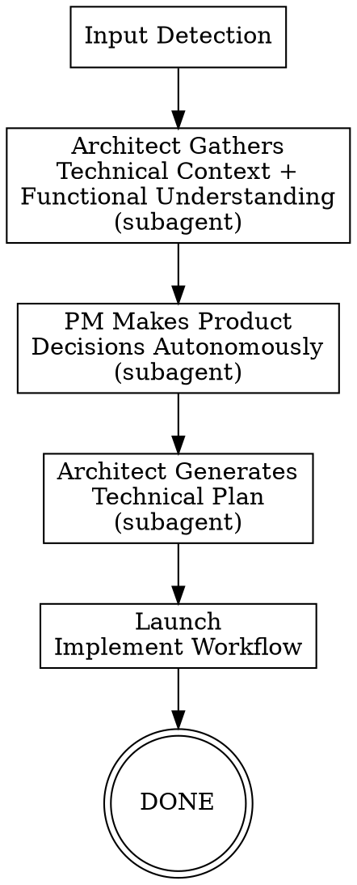

# /agentic:workflow:auto-implement - Idea to Implementation (Autonomous)

**Usage:** `/agentic:workflow:auto-implement [<input>]`

Take an imperfect prompt and autonomously go from idea to working code. Gathers codebase context, makes product decisions, creates a technical plan, then implements — all without manual intervention.

**For developers and solo devs.** Not a PM workflow — product decisions are made autonomously with documented assumptions.

## Arguments

- No args: prompt for idea
- `path/to/idea.md`: use existing notes file
- `#123` or `https://github.com/.../issues/123`: fetch GitHub issue
- Inline text: direct description

## Workflow Overview

```
1. Input Detection -> 2. Architect Context Gathering (subagent) -> 3. PM Autonomous Decisions (subagent) -> 4. Generate Technical Plan (subagent) -> 5. Launch Implement Workflow
```



---

## MANDATORY DELEGATION RULE

**You MUST delegate agent work using the `Task` tool. You MUST NOT perform agent work yourself.**

When a step says "delegate to Architect" or "delegate to PM", you:
1. Use Task tool to spawn subagent
2. Pass prompt (which tells subagent to read its own instructions)
3. Wait for result
4. Validate output exists
5. Update workflow state

**You NEVER:**
- Explore codebase yourself (delegate to Architect)
- Make product decisions yourself (delegate to PM)
- Write technical plans yourself (delegate to Architect)
- Write code yourself (delegate to Software Engineer via implement workflow)

If you catch yourself doing agent work, STOP and use Task tool.

## Subagent Invocation Pattern

Always use `{subagentTypeGeneralPurpose}` subagent type:

```
Task(subagent_type="{subagentTypeGeneralPurpose}", prompt="You are the Architect agent. {ide-invoke-prefix}{ide-folder}/agents/agentic-agent-architect.md for your full instructions. {task-specific context}")
Task(subagent_type="{subagentTypeGeneralPurpose}", prompt="You are the PM agent. {ide-invoke-prefix}{ide-folder}/agents/agentic-agent-pm.md for your full instructions. {task-specific context}")
```

Direct agents (steps 2-4): `agentic:agent:architect`, `agentic:agent:pm`

Transitive agents (via implement workflow, step 5): `agentic:agent:software-engineer`, `agentic:agent:test-engineer`, `agentic:agent:qa`, `agentic:agent:test-qa`, `agentic:agent:security-qa`

---

## EXECUTION STEPS

Execute each step in order by reading the corresponding step file.

| Step | File | Description |
|------|------|-------------|
| 1 | `steps/step-01-input-detection.md` | Parse args, classify input, initialize state |
| 2 | `steps/step-02-architect-context.md` | Delegate context gathering + functional understanding to Architect |
| 3 | `steps/step-03-pm-decisions.md` | Delegate autonomous product decisions to PM |
| 4 | `steps/step-04-technical-planning.md` | Delegate technical plan generation to Architect |
| 5 | `steps/step-05-launch-implement.md` | Launch implement workflow with generated plan |

**Start by reading `steps/step-01-input-detection.md` and follow NEXT STEP at end of each file.**

---

## AUTONOMOUS-ONLY WORKFLOW

This workflow is **always autonomous**. No interactive mode. The entire point is to go from rough idea to code without manual intervention.

All decisions are logged in `decision-log.md` with confidence scores. Low-confidence decisions (<90%) are flagged for post-implementation review.

---

## Decision Logging Protocol

When subagents make autonomous decisions, they append to `decision-log.md`:

```markdown
### DEC-{number}: {Brief Title}

**Step**: {current_step_name}
**Agent**: {deciding_agent}
**Timestamp**: {ISO timestamp}

**Context**:
{What question or ambiguity arose}

**Options Considered**:
1. {Option A} - {pros/cons}
2. {Option B} - {pros/cons}

**Decision**: {Chosen option}

**Confidence**: {percentage}%

**Rationale**:
{Why this choice was made}

**Trade-offs**: {what was sacrificed}
**Reversibility**: {Easy | Medium | Hard}

---
```

---

## TEMPLATES

| Template | Purpose |
|----------|---------|
| `templates/workflow-state.yaml` | Workflow state tracking schema |

---

## ARTIFACTS

All outputs: `{ide-folder}/{outputFolder}/task/auto-implement/{topic}/{instance_id}/`

| Artifact | Description |
|----------|-------------|
| `workflow-state.yaml` | Workflow state tracking |
| `decision-log.md` | All autonomous decisions from all agents |
| `input-idea.md` | Original idea/prompt |
| `technical-context.md` | Codebase analysis from Architect |
| `functional-understanding.md` | Plain-language behavior synthesis from Architect |
| `product-decisions.md` | Product scope, acceptance criteria from PM |
| `technical-plan.md` | Implementation plan from Architect |

---

## ERROR HANDLING

### Context Gathering Fails
If Architect returns incomplete context:
1. Re-run with more specific guidance
2. If second attempt fails, proceed with partial context (log as LOW_CONFIDENCE)

### PM Cannot Make Confident Decisions
If PM confidence < 90% on critical product decisions:
1. Log as LOW_CONFIDENCE in decision-log.md
2. Add to Open Questions section
3. Proceed with best-guess — developer reviews post-implementation

### Plan Generation Fails
If Architect cannot produce valid plan:
1. Re-run with explicit guidance about what's missing
2. If second attempt fails, HALT and present partial artifacts to developer

### Implement Workflow Fails
If implement workflow fails mid-execution:
1. Log error in workflow-state.yaml
2. Set status: "failed"
3. Present all artifacts generated so far for developer review

### Step Failure
If any step fails:
1. Log error in workflow-state.yaml
2. Set status: "failed"
3. Attempt recovery once, then halt with detailed error log

---

## Execution

**Start workflow by reading step 1:**

```
Read steps/step-01-input-detection.md
```

Follow each step file's instructions sequentially. Each step ends with a reference to the next step.
