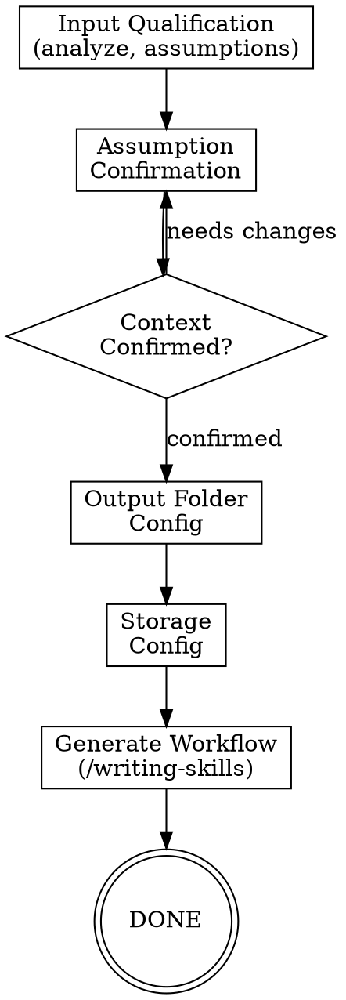

# /agentic:workflow:create-workflow - Create Workflow Skills

**Usage:** `/agentic:workflow:create-workflow <description>`

Create new agentic workflow skills through structured qualification, confirmation, configuration, and generation. Produces complete workflow directories following agentic patterns.

## Workflow Overview

```text
1. Input Qualification -> 2. Assumption Confirmation -> 3. Context Confirmation [loop if rejected] -> 4. Output Folder Config -> 5. Storage Config -> 6. Workflow Generation (/writing-skills)
```



---

## Step Files

Execute steps in order. Each step file contains detailed instructions.

| Step | File | Description |
|------|------|-------------|
| 1 | `steps/step-01-input-qualification.md` | Analyze input, log assumptions & open questions |
| 2 | `steps/step-02-assumption-confirmation.md` | Confirm each assumption, resolve open questions |
| 3 | `steps/step-03-context-confirmation.md` | Present full context, get user confirmation |
| 4 | `steps/step-04-output-config.md` | Detect IDE, ask output folder for workflow files |
| 5 | `steps/step-05-storage-config.md` | Ask where created workflow stores progress & artifacts |
| 6 | `steps/step-06-workflow-generation.md` | Generate all files using /writing-skills + agentic patterns |

**Start by reading `steps/step-01-input-qualification.md` and follow NEXT STEP at end of each file.**

---

## Templates

| Template | Description |
|----------|-------------|
| `templates/workflow-state.yaml` | State tracking template |

---

## Orchestrator Role

This workflow does NOT delegate to subagents — all work is orchestrator-driven through structured questioning and file generation.

You:

- Analyze the user's workflow idea
- Ask structured questions to qualify requirements (one at a time)
- Configure output location and artifact storage
- Generate workflow files following agentic patterns
- Invoke /writing-skills for skill creation discipline
- Register the workflow in `dependencies.ts` (if in agentic source tree)

**You NEVER:**

- Skip assumption confirmation (step 2)
- Generate files before full context is confirmed (step 3)
- Guess the output folder without asking (step 4)
- Assume artifact storage strategy without asking (step 5)

---

## Error Handling

### Input Too Vague

If the workflow description lacks enough detail to extract assumptions:

1. Ask clarifying questions one at a time
2. Build understanding incrementally
3. Do NOT proceed to step 2 until at least 3 assumptions can be formed

### Context Rejected Multiple Times

If user rejects context confirmation 3+ times:

1. Ask user to describe the workflow in their own words
2. Use verbatim description as the new baseline
3. Re-run from step 1

### Generation Failure

If file generation fails:

1. Log error in workflow-state.yaml
2. Present error to user
3. Ask how to proceed

---

## Artifacts

All outputs: `{ide-folder}/{outputFolder}/task/create-workflow/{topic}/{instance_id}/`

- `workflow-state.yaml` — progress tracking
- `qualified-input.md` — analyzed input with assumptions & open questions
- `workflow-design.md` — full qualified context document
- Generated workflow directory (output location configured in step 4)

---

## Execution

**Start workflow by reading step 1:**

```text
Read steps/step-01-input-qualification.md
```

Follow each step file's instructions sequentially. Each step ends with a reference to the next step.
