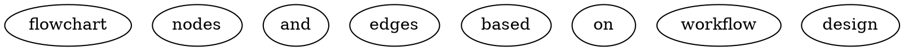

# Step 6: Workflow Generation

## EXECUTION RULES

- Invoke /writing-skills for skill creation discipline
- Generate all workflow files following agentic patterns
- Use the workflow-design.md as the source of truth
- Register in dependencies.ts if in agentic source tree
- Validate all generated files
- Output: complete workflow directory

---

## SEQUENCE

### 6.1 Invoke /writing-skills

**MANDATORY:** Before generating any files, invoke the `/writing-skills` skill.

This ensures the generated workflow follows TDD discipline for skill creation:
- Proper frontmatter with CSO-optimized description
- Correct naming conventions
- Quality checks

Read and follow `/writing-skills` principles throughout this step.

### 6.2 Prepare Generation Context

Gather all inputs for generation:

```yaml
# From workflow-state.yaml
name: {created_workflow.name}
description: {created_workflow.description}
mode: {created_workflow.mode}
steps: {created_workflow.steps}
agents: {created_workflow.agents}
skills: {created_workflow.skills}
output_folder: {output_folder}
storage_strategy: {storage_strategy}
storage_category: {storage_category}
in_agentic_source_tree: {boolean}
```

Read `{output_path}/workflow-design.md` for the full design specification.

### 6.3 Create Directory Structure

```bash
mkdir -p {generated_workflow_path}/steps
mkdir -p {generated_workflow_path}/templates
```

### 6.4 Generate SKILL.md

**Write `{generated_workflow_path}/SKILL.md`:**

Follow the agentic workflow SKILL.md pattern:

```markdown
---
name: {name}
description: {CSO-optimized description — starts with "Use when...", max 500 chars}
argument-hint: "{argument pattern}"
---

# /agentic:workflow:{name} - {Title}

**Usage:** `/agentic:workflow:{name} {argument-hint}`

{One-line purpose description.}

## Workflow Overview

```text
{step 1} -> {step 2} -> ... -> {step N}
```



---

## Step Files

| Step | File | Description |
|------|------|-------------|
{for each step in created_workflow.steps}
| {n} | `steps/step-{nn}-{step-name}.md` | {description} |
{end}

**Start by reading `steps/step-01-{first-step-name}.md`.**

---

## Templates

| Template | Description |
|----------|-------------|
| `templates/workflow-state.yaml` | State tracking template |

---

{if agents.length > 0}
## Subagent References

Invoke: `Task(subagent_type="{subagentTypeGeneralPurpose}", prompt="...")`

Available agents: {list agents with descriptions}

---

## Mandatory Delegation

You are the orchestrator. Delegate all specialized work using the Task tool.
{end}

{if mode includes interactive}
## THE GATE RULE

{gate rules from workflow-design.md, if any}
{end}

{if mode == "switchable"}
## Mode Behaviors

**Interactive Mode (default):** {describe}
**Auto Mode (--auto):** {describe}
{end}

---

## Error Handling

{error handling from workflow-design.md}

---

## Artifacts

All outputs: `{storage_path_template}`

{list artifacts from workflow-design.md}

---

## Execution

**Start workflow by reading step 1:**

```text
Read steps/step-01-{first-step-name}.md
```
```

**CSO checklist for the description:**
- [ ] Starts with "Use when..."
- [ ] Third person
- [ ] Includes specific triggers/symptoms
- [ ] Does NOT summarize the workflow process
- [ ] Under 500 characters

### 6.5 Generate Step Files

For each step in `created_workflow.steps`, generate a step file:

**Write `{generated_workflow_path}/steps/step-{NN}-{step-name}.md`:**

Follow the agentic step file pattern:

```markdown
# Step {N}: {Step Title}

## EXECUTION RULES

- {rule 1}
- {rule 2}
- Do not proceed until {completion condition}
- Output: {expected output}

---

## SEQUENCE

### {N}.1 {First Substep}

{detailed instructions}

### {N}.2 {Second Substep}

{detailed instructions}

...

### {N}.{last} Complete Step

**Update workflow-state.yaml:**
```yaml
steps_completed:
  - step: {N}
    name: "{step-name}"
    completed_at: {ISO_timestamp}

current_step: {N+1}
updated_at: {ISO_timestamp}
```

---

## NEXT STEP

Load and execute: `step-{NN+1}-{next-step-name}.md`
```

**For each step, tailor content based on:**

| Step Type | Content Pattern |
|-----------|----------------|
| **Input parsing** | Pattern matching, variable extraction, validation |
| **Delegation** | Task tool invocation with full prompt, output validation |
| **Interactive** | AskUserQuestion one at a time, challenge patterns, decision logging |
| **Gate check** | Critical vs minor classification, blocking rules |
| **Compilation** | Aggregate artifacts, validate sections, write output |

**For delegated steps, use the agentic subagent invocation pattern:**

```
Task(subagent_type="{subagentTypeGeneralPurpose}", prompt="
# MANDATORY FIRST ACTION - DO NOT SKIP

{ide-invoke-prefix}{ide-folder}/agents/agentic-agent-{agent-name}.md

This file contains your role, skill loading instructions (you MUST use the Skill tool for each skill listed), and output format. Complete ALL setup steps in that file before proceeding.

After setup, confirm: 'Agent file read. Skills loaded. Beginning {task}.'

{language_skills_prompt}

# TASK: {Task description}

{task-specific context}
")
```

**For interactive steps, use the questioning pattern:**
- One question at a time
- Multiple choice when possible
- Challenge vague answers
- Log decisions

**For the final step:**
- Replace `## NEXT STEP` with:
```markdown
## WORKFLOW COMPLETE

Update workflow-state.yaml:
```yaml
status: "completed"
completed_at: {ISO_timestamp}
```

Report to user with artifact locations.
```

### 6.6 Generate workflow-state.yaml Template

**Write `{generated_workflow_path}/templates/workflow-state.yaml`:**

```yaml
# Workflow State Template
# Tracks progress through {name} workflow
# Location: {storage_path_template}/workflow-state.yaml

workflow: {name}
version: "1.0.0"

{if mode == "switchable"}
# Workflow configuration
mode: "interactive" # or "auto"
{end}

# Input
input_type: "" # {list valid input types}
input_source: null

# Topic
topic: ""
instance_id: ""
output_path: ""

# Timing
started_at: ""
updated_at: ""
completed_at: null

# Progress
status: "pending" # pending | in_progress | completed | failed
current_step: 0
steps_completed: []

{workflow-specific counters from design}

# Artifacts
artifacts:
  {for each artifact in design}
  {artifact_key}: null
  {end}

{if mode includes autonomous}
# Decision log (auto mode)
  decision_log: null
{end}

# Validation
validation:
  {for each gate/checkpoint in design}
  {gate_key}: false
  {end}
```

### 6.7 Configure Storage Backend

**Based on `storage_strategy`:**

**If "agentic_output":**
- Step 1 of the generated workflow uses:
  ```yaml
  output_path: "{ide-folder}/{outputFolder}/{storage_category}/{topic}/{instance_id}"
  ```

**If "github_issues":**
- Add a step or substep that creates/comments on a GitHub issue:
  ```bash
  gh issue create --title "Workflow: {name} - {topic}" --body "{state summary}"
  # or
  gh issue comment {issue_number} --body "{step update}"
  ```

**If "notion":**
- Add a step or substep that creates/updates a Notion page:
  ```
  # Include notion API call template
  # User will need to configure NOTION_TOKEN
  ```

**If "custom":**
- Add a placeholder step with the user's storage description:
  ```markdown
  ### {N}.X Store Artifacts

  **Custom storage backend:** {storage_description}

  TODO: Implement storage integration here.
  ```

### 6.8 Register in dependencies.ts (If Applicable)

**Only if `in_agentic_source_tree == true`:**

1. Add `'{name}'` to the `WorkflowName` type union
2. Add entry to `WORKFLOW_DEPENDENCY_MAP`:

```typescript
'{name}': {
  agents: [{agents list}],
  skills: [{skills list}],
  argumentHint: '{argument-hint}',
},
```

**If not in agentic source tree:** Skip this step, output instructions:

```
To register this workflow with agentic, add it to src/cli/dependencies.ts:
1. Add '{name}' to WorkflowName type
2. Add entry to WORKFLOW_DEPENDENCY_MAP
```

### 6.9 Validate Generated Files

Check all generated files:

- [ ] SKILL.md has valid YAML frontmatter (name + description only)
- [ ] Description starts with "Use when..."
- [ ] All step files exist and reference correct next step
- [ ] Last step has WORKFLOW COMPLETE instead of NEXT STEP
- [ ] workflow-state.yaml template has all required fields
- [ ] Step numbering is sequential with no gaps
- [ ] Subagent invocations use correct pattern (if applicable)
- [ ] Storage backend is correctly configured

**If validation fails:** Fix issues and re-validate.

### 6.10 Complete Step

**Update workflow-state.yaml:**
```yaml
artifacts:
  generated_workflow_path: "{generated_workflow_path}"

steps_completed:
  - step: 6
    name: "workflow-generation"
    completed_at: {ISO_timestamp}
    output: "{generated_workflow_path}"

status: "completed"
completed_at: {ISO_timestamp}
updated_at: {ISO_timestamp}
```

**Output to user:**

```
Workflow generated successfully!

Location: {generated_workflow_path}
Files created:
  - SKILL.md
  - steps/step-01-{...}.md
  - steps/step-02-{...}.md
  - ...
  - templates/workflow-state.yaml
{if registered: "Registered in dependencies.ts"}

Next steps:
1. Review the generated files
2. Run `agentic update` to deploy the workflow
3. Test with: /agentic:workflow:{name} {example input}
```

---

## WORKFLOW COMPLETE

This is the final step. The create-workflow workflow is now complete.
