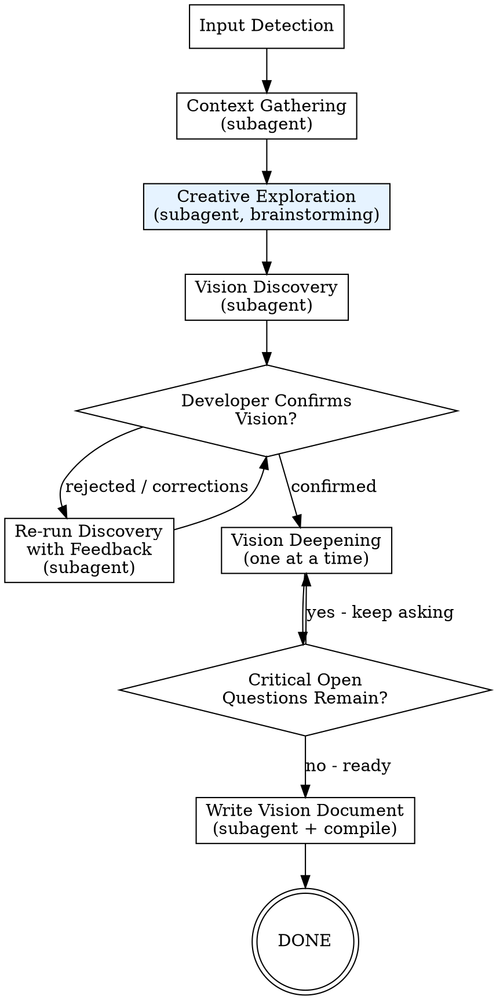
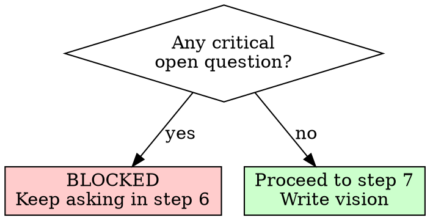

# /agentic:workflow:product-vision - Idea to Product Vision

**Usage:** `/agentic:workflow:product-vision [<input>]`

Transform a rough idea into a comprehensive product vision document through creative brainstorming and rigorous questioning. Always interactive — no auto mode.

## Arguments

- No args: Prompt for idea
- `path/to/notes.md`: Use existing notes/idea file

## Workflow Overview

```text
1. Input Detection -> 2. Context Gathering (subagent) -> 3. Creative Exploration (subagent, brainstorming techniques) -> 4. Vision Discovery (subagent) -> 5. Confirm Vision [loop if rejected] -> 6. Vision Deepening -> 7. Write Vision Document
```



---

## Step Files

Execute steps in order. Each step file contains detailed instructions.

| Step | File | Description |
|------|------|-------------|
| 1 | `steps/step-01-input-detection.md` | Parse args, init state, generate topic slug |
| 2 | `steps/step-02-context-gathering.md` | Gather product & technical context from codebase |
| 3 | `steps/step-03-creative-exploration.md` | Brainstorming session with creative techniques |
| 4 | `steps/step-04-vision-discovery.md` | Structured vision element discovery (informed by brainstorming) |
| 5 | `steps/step-05-confirm-vision.md` | Developer confirms vision direction; loop if rejected |
| 6 | `steps/step-06-vision-deepening.md` | Ask remaining vision questions one at a time |
| 7 | `steps/step-07-write-vision.md` | Compile comprehensive vision document |

**Start by reading `steps/step-01-input-detection.md` and follow NEXT STEP at end of each file.**

---

## Templates

| Template | Description |
|----------|-------------|
| `templates/workflow-state.yaml` | State tracking template |
| `templates/vision-document.md` | Output document template |

## Supporting Files

| File | Description |
|------|-------------|
| `brain-methods.csv` | 62 brainstorming techniques across 10 categories |

## Subagent References

All product work is delegated to the CPO subagent, which loads its own skills (product-vision, product-discovery, brainstorming) via mandatory setup.

Invoke: `Task(subagent_type="{subagentTypeGeneralPurpose}", prompt="You are the CPO agent. {ide-invoke-prefix}{ide-folder}/agents/agentic-agent-cpo.md for your full instructions and mandatory setup. ...")`

---

## Mandatory Delegation

**You MUST delegate all discovery/brainstorming/context-gathering work using the Task tool. NEVER do it inline.**

You are the orchestrator. You:

- Parse input
- Initialize state tracking
- Invoke subagents in sequence
- Handle handoffs between agents
- Validate outputs at each step
- Run the vision deepening loop yourself (step 6)
- Delegate vision document writing to CPO subagent

**You NEVER:**

- Gather codebase context yourself (delegate to Explore subagent)
- Run brainstorming sessions yourself (delegate to CPO subagent)
- Ask discovery questions yourself (delegate to CPO subagent)
- Write vision documents yourself (delegate to CPO subagent)

If you catch yourself doing agent work instead of delegating, STOP and use the Task tool.

---

## THE GATE RULE

**You MUST NOT proceed to step 7 (write vision) if critical open questions remain.**

Critical = questions about vision direction, problem space, target users, strategic goals, value proposition, or product principles.

Minor = visual preferences, specific metric targets, implementation details. These can remain.



**If the developer says "just decide" or "I don't care":**

- Challenge once: "This shapes the vision. Are you sure you want me to choose?"
- If they insist: log as DEVELOPER_DEFERRED, make best-guess, proceed

---

## Error Handling

### Discovery Incomplete

If discovery output missing required sections:
1. Log which sections are missing
2. Ask user to provide missing info

### Discovery Rejected Multiple Times

If developer rejects vision 3+ times:
1. Log specific complaints
2. Ask developer to describe what's wrong in their own words
3. Feed verbatim description to Discovery subagent

### Developer Refuses to Answer Questions

If developer says "skip" or "later" on a critical question:
1. Explain why this question is critical for the vision
2. If they insist: mark as UNRESOLVED_CRITICAL
3. **UNRESOLVED_CRITICAL questions block vision document generation**

### Step Failure

If any step fails:
1. Log error in workflow-state.yaml
2. Set status: "failed"
3. Present error, ask how to proceed

---

## Artifacts

All outputs: `{ide-folder}/{outputFolder}/product/vision/{topic}/{instance_id}/`

- `workflow-state.yaml`
- `context-{topic}.md`
- `brainstorming-{topic}.md`
- `discovery-{topic}.md`
- `vision-decisions.md`
- `vision-{topic}.md`
