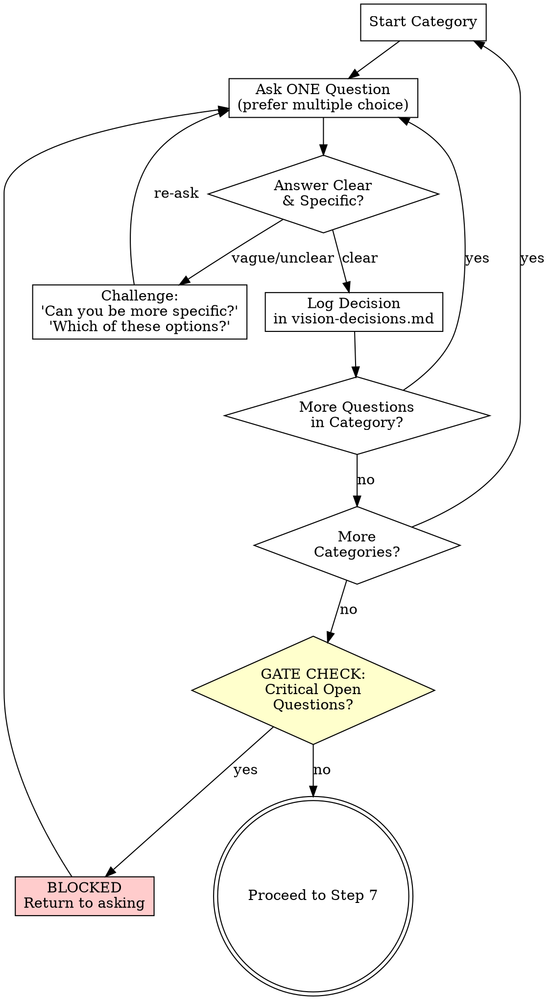

# Step 6: Vision Deepening

---

## ORCHESTRATOR ACTION

**You do this step yourself. This is the core of the workflow.**

Ask the developer every vision question needed to produce a comprehensive vision document. One question at a time. Challenge vague answers. Do not stop until no critical open questions remain.

---

## PRINCIPLES

1. **One question at a time.** Never ask multiple questions in a single message.
2. **Prefer multiple choice** when options are enumerable.
3. **Push hard.** Vague answers like "whatever works" or "you decide" get challenged.
4. **Use discovery context.** Reference specific findings from `discovery-{topic}.md`.
5. **Use brainstorming insights.** Reference breakthrough ideas from `brainstorming-{topic}.md`.
6. **Use codebase context.** Reference integration points from `context-{topic}.md`.
7. **Track everything.** Every answer becomes a logged decision.

---

## QUESTION CATEGORIES

Work through these in order. Skip categories already fully covered by discovery. Focus on gaps.

### 1. Vision Clarity

- Is the vision statement inspiring AND specific enough?
- Does it describe a clear future state?
- Would everyone on the team interpret it the same way?
- Is the "why now" compelling?

### 2. Problem Space Depth

- Are all pain points identified and validated?
- Are root causes articulated (not just symptoms)?
- Is the impact quantified or at least qualified?
- What happens if we don't solve this? (cost of inaction)

### 3. User Precision

- Are all user types/personas identified?
- Are personas specific enough? (not just "developers" but "senior backend devs in teams of 5-15")
- What are their current workarounds?
- What does success look like for each persona?

### 4. Market Understanding

- Who are the real competitors/alternatives?
- What's our positioning vs. each?
- What market trends support this vision?
- What threats could derail it?

### 5. Value Proposition Sharpness

- Can you explain the core value in one sentence?
- What makes this uniquely better than alternatives?
- What unfair advantages do we have?
- Why would a user switch from their current solution?

### 6. Product Principles

- Are principles real stances (not platitudes)?
- When two principles conflict, which wins?
- Would saying the opposite of a principle also be reasonable? (if not, it's a platitude)
- Are there 5-7 principles, not more?

### 7. Strategic Goals & Metrics

- Are short-term goals achievable and validating?
- Are metrics measurable with existing/planned infrastructure?
- What are baseline numbers today?
- What targets are ambitious but realistic?

### 8. Feature Prioritization

- Is every must-have truly required for v1?
- Is anything in should-have actually a must-have?
- Are out-of-scope items clearly excluded?
- Is the scope achievable in the timeline?

### 9. User Journey Completeness

- Are the critical user flows identified?
- Does each journey have clear success criteria?
- Are failure/error paths considered?
- Do journeys cover all primary personas?

### 10. Business Model

- How does this generate or protect revenue?
- What are the key cost drivers?
- Are pricing assumptions validated?
- What's the path to sustainability?

### 11. Risks & Assumptions

- Are critical assumptions identified?
- How will each assumption be validated?
- Are key risks mitigated, not just listed?
- What's the "kill criteria" -- when do we stop?

### 12. Roadmap Feasibility

- Are phases sequenced logically?
- Does each phase have clear exit criteria?
- Are dependencies between phases identified?
- Is the timeline realistic?

---

## QUESTIONING FLOW



### Challenging Weak Answers

| Weak Answer | Challenge |
|-------------|-----------|
| "All users" | "Which specific user types? Role, context, frequency?" |
| "It should be fast" | "What's the target? Under 200ms? Under 1s? What's acceptable?" |
| "Whatever makes sense" | "There are N options: [list]. Each has trade-offs. Which fits?" |
| "You decide" | "This shapes the vision. I need your input: [A, B, or C]?" |
| "Standard behavior" | "Standard for whom? Can you describe the exact expected behavior?" |
| "Doesn't matter" | "It matters for [reason]. Let me narrow it: [A] or [B]?" |
| "Later" / "Skip" | "This is critical for the vision. Without it, the document will have a gap. Can we decide now?" |
| "I don't know" | "Based on the brainstorming, [option] seems most promising. Does that work?" |
| "Just make it work" | "What does 'working' look like? Describe the ideal outcome." |
| "We'll figure it out" | "The vision needs a clear direction here. From brainstorming: [A, B, C]. Which resonates?" |

### Handling "Just Decide For Me"

If the developer insists you decide on a critical question:

1. Challenge once: "This shapes the vision. Are you sure?"
2. If they insist: propose your recommendation with rationale (reference brainstorming insights)
3. Ask: "Going with [recommendation]. Confirm?"
4. Log as `DEVELOPER_DEFERRED` decision

---

## DECISION LOGGING

Initialize `{output_path}/vision-decisions.md` at start of this step:

```markdown
# Vision Decisions - {topic}

> All vision decisions made during deepening.

**Started:** {ISO_timestamp}

---

## Decisions
```

**For each answered question, append:**

```markdown
### VD-{number}: {Brief Title}

**Category**: {category name}
**Question**: {exact question asked}
**Answer**: {developer's answer}
**Decision**: {concrete decision derived from answer}
**Impact**: {what this decision affects in the vision}

---
```

**For DEVELOPER_DEFERRED decisions, append:**

```markdown
### VD-{number}: {Brief Title} [DEVELOPER_DEFERRED]

**Category**: {category name}
**Question**: {exact question asked}
**Developer said**: "just decide" / "you choose"
**Recommendation**: {your recommendation}
**Rationale**: {why, reference brainstorming insights}
**Developer confirmed**: yes/no

---
```

---

## GATE CHECK

After exhausting all relevant categories, perform the gate check.

### Classify Remaining Open Questions

| Type | Definition | Blocks Vision? |
|------|-----------|---------------|
| **CRITICAL** | Changes shape of vision (vision statement, problem space, users, value prop, principles, strategic goals) | **YES** |
| **MINOR** | Implementation details, specific metrics targets, visual preferences, nice-to-have features | No |

### Gate Rules

**If CRITICAL open questions remain:**

```text
We still have {N} critical open questions that would change the shape of the vision:

{numbered list}

I need answers to these before writing the vision document. Let's go through them.
```

Return to questioning.

**If only MINOR open questions remain:**

```text
All critical vision decisions are made. There are {N} minor open questions remaining:

{numbered list}

These won't affect the vision structure. I'll make reasonable defaults and note them.

Ready to write the vision document?
```

Wait for developer confirmation before proceeding.

---

## STEP COMPLETION

**Only when gate check passes (no critical open questions):**

Update `workflow-state.yaml`:

```yaml
artifacts:
  vision_decisions: "{output_path}/vision-decisions.md"

questions_asked: {total}
critical_open_questions: 0
decisions_logged: {total}

validation:
  gate_passed: true

steps_completed:
  - step: 6
    name: "vision-deepening"
    completed_at: {ISO_timestamp}
    output: "{output_path}/vision-decisions.md"

current_step: 7
updated_at: {ISO_timestamp}
```

---

## NEXT STEP

Load `step-07-write-vision.md`
